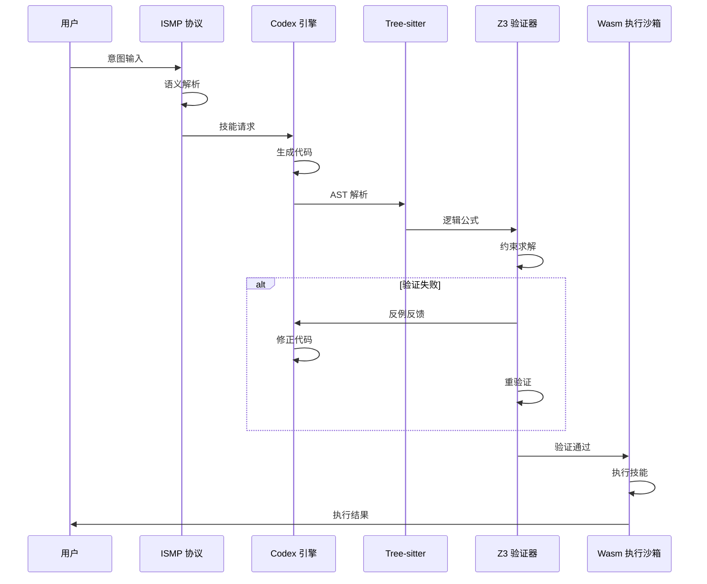

# 自主认知技能系统技术实现蓝图

**项目代号**: AetherHub
**文档版本**: v1.0
**创建日期**: 2026-03-10
**技术栈**: Codex + Z3 + WebAssembly + Tree-sitter

---

## 目录

1. [架构概览](#1-架构概览)
2. [核心组件设计](#2-核心组件设计)
3. [技术实现路径](#3-技术实现路径)
4. [安全验证机制](#4-安全验证机制)
5. [系统集成方案](#5-系统集成方案)
6. [实施路线图](#6-实施路线图)

---

## 1. 架构概览

### 1.1 系统定位

AetherHub 是一个完全自主的、可验证的技能驱动系统，具备以下特征：

- **架构自主性**: 完整源代码控制，无第三方依赖
- **动态生成**: 即时技能合成，而非静态存储
- **形式化验证**: 数学级别的安全性证明
- **自我进化**: 技能生成技能的递归能力

### 1.2 总体架构

```
┌─────────────────────────────────────────────────────────────┐
│                    用户意图层 (User Intent)                    │
└───────────────────────┬─────────────────────────────────────┘
                        │
                        ▼
┌─────────────────────────────────────────────────────────────┐
│              意图-技能映射协议 (ISMP) - 意图解析                │
│  • 语义向量化  • 情境感知逻辑合成  • 约束动态注入              │
└───────────────────────┬─────────────────────────────────────┘
                        │
                        ▼
┌─────────────────────────────────────────────────────────────┐
│            Codex 代码生成引擎 - 动态技能合成                    │
│  • 原子技能生成  • 模块化技能链路  • 安全约束嵌入              │
└───────────────────────┬─────────────────────────────────────┘
                        │
                        ▼
┌─────────────────────────────────────────────────────────────┐
│            Tree-sitter 逻辑提取层 - AST 解析                   │
│  • 代码语义提取  • 逻辑公式转化  • 中间表示生成                │
└───────────────────────┬─────────────────────────────────────┘
                        │
                        ▼
┌─────────────────────────────────────────────────────────────┐
│            Z3 形式化验证沙箱 - 安全证明引擎                    │
│  • 约束求解验证  • 反例反馈修正  • 闭环自修复机制              │
└───────────────────────┬─────────────────────────────────────┘
                        │
                        ▼
┌─────────────────────────────────────────────────────────────┐
│            Wasmtime 安全运行时 - 轻量级执行沙箱                  │
│  • 指令级隔离  • 资源限制  • 微型虚拟机可选                    │
└─────────────────────────────────────────────────────────────┘
```

---

## 2. 核心组件设计

### 2.1 Codex 代码生成引擎

**功能定位**: 系统的核心大脑，负责将意图转换为可执行的技能代码

**关键能力**:
- 原子技能生成: Read, Write, Filter, Execute 等
- 模块化技能链路: 毫秒级技能组合
- 安全约束嵌入: 内置安全规则生成

**技术要点**:
- 使用系统提示词 (System Prompt) 引导生成符合安全规范的代码
- 集成 Tree-sitter 解析结果，确保生成的代码结构化
- 支持"生成-验证-修正"的迭代循环

### 2.2 Tree-sitter 逻辑提取层

**功能定位**: 将生成的代码转化为可进行数学推演的形式化语言

**技术选型**: Tree-sitter

**工作流程**:
```python
# 伪代码流程
code = codex.generate_skill(intent)
ast = tree_sitter.parse(code)
logic_formula = ast_to_formula(ast)  # 转化为数学公式
```

**输出**:
- 抽象语法树 (AST)
- 逻辑公式表示
- 代码语义映射

### 2.3 Z3 形式化验证沙箱

**功能定位**: 证明代码逻辑的正确性与安全性

**技术选型**: Z3 Theorem Prover

**安全规则集示例**:
```python
# 系统安全规则
RULES = {
    "禁止系统级调用": "禁止 __init__、__main__ 等特殊函数",
    "禁止无限循环": "循环深度限制在 1000 以内",
    "禁止内存越界": "数组访问必须在合法范围内",
    "禁止文件系统滥用": "禁止访问 /usr, /etc, /sys 等系统目录"
}
```

**验证流程**:
1. 定义符号变量表示代码逻辑
2. 注入生成的代码逻辑
3. 设定冲突目标（违反规则）
4. 执行验证
5. 返回 unsat/sat 结果

### 2.4 Wasmtime 安全运行时

**功能定位**: 在受限环境中执行验证通过的技能代码

**技术选型**: Wasmtime

**隔离机制**:
- 指令级资源隔离
- 内存边界限制
- 时间限制（防止死循环）
- 文件系统沙箱

**性能特点**:
- 毫秒级启动
- 低内存占用（MB 级）
- 跨平台兼容

---

## 3. 技术实现路径

### 3.1 Phase 1: 基础设施搭建

**目标**: 搭建核心组件环境

**任务清单**:
- [ ] 安装并配置 Z3 求解器
- [ ] 安装并配置 Tree-sitter
- [ ] 安装并配置 Wasmtime
- [ ] 创建项目骨架
- [ ] 编写基础工具函数

**预期交付**:
- 可运行的 Z3 验证脚本
- Tree-sitter 解析示例
- Wasmtime 执行沙箱框架

### 3.2 Phase 2: Codex 集成与技能生成

**目标**: 实现意图到代码的动态生成

**任务清单**:
- [ ] 设计意图-技能映射协议 (ISMP) 原型
- [ ] 实现 Codex 调用接口
- [ ] 实现技能原子化生成
- [ ] 实现技能链路组合
- [ ] 集成安全约束模板

**预期交付**:
- ISMP 协议实现
- 基础技能库（Read, Write, Execute）
- 意图解析与技能合成模块

### 3.3 Phase 3: 形式化验证集成

**目标**: 实现代码安全验证

**任务清单**:
- [ ] 实现 Tree-sitter 到逻辑公式的转换
- [ ] 实现安全规则集定义
- [ ] 实现 Z3 约束注入
- [ ] 实现验证-反馈-修正闭环
- [ ] 实现验证结果可视化

**预期交付**:
- 完整的验证流水线
- 验证报告生成器
- 安全规则配置系统

### 3.4 Phase 4: Wasm 执行沙箱

**目标**: 实现安全执行环境

**任务清单**:
- [ ] 实现 Wasm 模块生成
- [ ] 实现沙箱边界限制
- [ ] 实现资源监控
- [ ] 实现技能调用 API
- [ ] 实现错误处理机制

**预期交付**:
- 完整的执行沙箱
- 技能调用接口
- 错误处理与日志系统

### 3.5 Phase 5: 系统集成与优化

**目标**: 完成系统集成与性能优化

**任务清单**:
- [ ] 整合所有组件
- [ ] 实现完整的"意图-生成-验证-执行"流水线
- [ ] 性能优化（缓存、并行化）
- [ ] 错误处理与恢复机制
- [ ] 监控与日志系统

**预期交付**:
- 完整的 AetherHub 系统
- API 文档
- 运维手册

---

## 4. 安全验证机制

### 4.1 多层防御架构

```
┌─────────────────────────────────────────────────────────────┐
│              第1层: 意图解析过滤（ISMP）                       │
│  • 检测恶意意图  • 拒绝明显危险操作                          │
└───────────────────────┬─────────────────────────────────────┘
                        │ 通过
                        ▼
┌─────────────────────────────────────────────────────────────┐
│              第2层: 代码生成约束（Codex）                      │
│  • 内置安全规则  • 禁止危险API调用                           │
└───────────────────────┬─────────────────────────────────────┘
                        │ 通过
                        ▼
┌─────────────────────────────────────────────────────────────┐
│              第3层: 形式化验证（Z3）                           │
│  • 逻辑正确性证明  • 违反规则检测                            │
└───────────────────────┬─────────────────────────────────────┘
                        │ 通过
                        ▼
┌─────────────────────────────────────────────────────────────┐
│              第4层: Wasm 执行沙箱（Wasmtime）                  │
│  • 指令级隔离  • 资源限制  • 运行时监控                      │
└─────────────────────────────────────────────────────────────┘
```

### 4.2 典型验证案例

#### 案例 1: 文件写入安全验证

**意图**: "将文件 /tmp/data.txt 写入用户目录"

**验证流程**:
```python
# 1. 生成代码
code = codex.generate("write_file /tmp/data.txt")

# 2. 提取逻辑
ast = tree_sitter.parse(code)
formula = ast_to_formula(ast)

# 3. 定义安全规则
rules = {
    "禁止系统目录": "path.startswith('/etc') or path.startswith('/usr') or path.startswith('/sys')"
}

# 4. 验证
solver = Solver()
solver.add(formula)
solver.add(rules["禁止系统目录"])

if solver.check() == unsat:
    print("验证通过")
else:
    print("验证失败，检测到非法访问")
```

#### 案例 2: 循环深度限制验证

**意图**: "处理 10000 条数据"

**验证流程**:
```python
# 检查循环深度
max_depth = 1000
for_loop = extract_loop(code)

if for_loop.depth > max_depth:
    print("循环深度超限，拒绝执行")
```

---

## 5. 系统集成方案

### 5.1 端到端流程



### 5.2 API 设计

#### 5.2.1 技能调用 API

```python
# 技能调用接口
class SkillAPI:
    def execute(self, intent: str) -> dict:
        """
        执行技能
        :param intent: 用户意图
        :return: 执行结果
        """
        # 1. 意图解析
        skills = self.ismp.parse(intent)

        # 2. 代码生成
        code = self.codex.generate(skills)

        # 3. 逻辑提取
        ast = self.tree_sitter.parse(code)
        formula = self.ast_to_formula(ast)

        # 4. 形式化验证
        if not self.z3.verify(formula):
            raise SecurityViolation("代码验证失败")

        # 5. Wasm 执行
        result = self.wasmtime.execute(code)

        return result
```

#### 5.2.2 验证报告 API

```python
# 验证报告生成
class VerificationReport:
    def generate(self, code: str, formula: Formula, result: str) -> dict:
        return {
            "code_hash": hash(code),
            "verified": result == "unsat",
            "formula": str(formula),
            "security_rules": self.get_applied_rules(),
            "execution_time": self.execution_time,
            "timestamp": datetime.now()
        }
```

---

## 6. 实施路线图

### 6.1 时间线规划

**Month 1-2: 基础设施搭建**
- Week 1-2: 环境配置与工具安装
- Week 3-4: 基础工具开发

**Month 3-4: Codex 集成**
- Week 5-6: ISMP 协议原型
- Week 7-8: 技能生成引擎
- Week 9-10: 技能库构建

**Month 5-6: 验证系统集成**
- Week 11-12: Tree-sitter 集成
- Week 13-14: Z3 验证器集成
- Week 15-16: 闭环自修复实现

**Month 7-8: 执行沙箱**
- Week 17-18: Wasm 集成
- Week 19-20: 沙箱边界限制
- Week 21-22: 错误处理

**Month 9-10: 系统集成与优化**
- Week 23-24: 端到端流水线
- Week 25-26: 性能优化
- Week 27-28: 测试与文档

### 6.2 风险与应对

| 风险 | 影响 | 概率 | 应对措施 |
|------|------|------|----------|
| Codex 生成代码质量不稳定 | 高 | 中 | 多轮迭代验证，人工审查 |
| Z3 验证性能不足 | 中 | 中 | 优化规则集，并行验证 |
| Wasm 沙箱限制过多 | 中 | 低 | 提供可配置的边界参数 |
| 系统集成复杂度高 | 高 | 高 | 分模块开发，持续集成 |

---

## 附录

### A. 技术选型对比

| 组件 | 备选方案 | 最终选择 | 理由 |
|------|----------|----------|------|
| 代码生成 | GPT-4, Claude | Codex | 代码生成能力强，支持迭代修正 |
| 逻辑提取 | ANTLR, PLY | Tree-sitter | 高性能，多语言支持 |
| 形式化验证 | SMT-Solver, Alloy | Z3 | 业界标准，性能优秀 |
| 执行沙箱 | Docker, PyPy | Wasmtime | 轻量级，隔离性强 |

### B. 参考资料

1. [Z3 Theorem Prover Documentation](https://github.com/Z3Prover/z3)
2. [Tree-sitter Documentation](https://tree-sitter.github.io/tree-sitter/)
3. [Wasmtime Documentation](https://wasmtime.dev/)
4. [Codex API Documentation](https://platform.openai.com/docs/guides/gpt/codex)

---

**文档结束**
