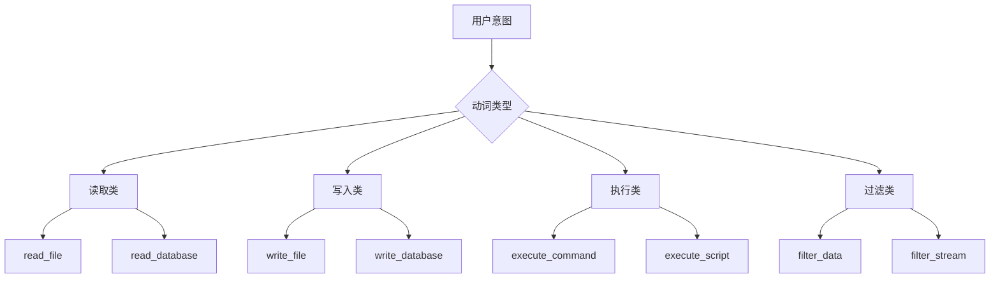

# 意图-技能映射协议 (ISMP) 详细设计

**协议版本**: v1.0
**创建日期**: 2026-03-10
**状态**: 设计完成

---

## 目录

1. [协议概述](#1-协议概述)
2. [核心概念](#2-核心概念)
3. [协议流程](#3-协议流程)
4. [技能原子化](#4-技能原子化)
5. [约束动态注入](#5-约束动态注入)
6. [证明携带式产物](#6-证明携带式产物)
7. [实现示例](#7-实现示例)

---

## 1. 协议概述

### 1.1 协议定位

ISMP (Intent-Skill Mapping Protocol) 是 AetherHub 系统的核心协议，负责将模糊的用户意图转换为精确的、可验证的技能代码。

### 1.2 设计目标

- **语义精度**: 准确解析模糊意图
- **安全保证**: 自动注入安全约束
- **可验证性**: 生成包含验证证明的产物
- **灵活性**: 支持多场景、多任务

---

## 2. 核心概念

### 2.1 能力空间 (Capability Space)

将所有可能的技能操作映射到预定义的能力空间中：

```
Capability Space = {
    "Read": "读取文件/数据库",
    "Write": "写入文件/数据库",
    "Filter": "数据过滤",
    "Execute": "执行命令/脚本",
    "Network": "网络操作",
    "System": "系统调用",
    "Memory": "内存操作",
    "Filesystem": "文件系统操作"
}
```

### 2.2 原子技能 (Atomic Skills)

不可再分的最小技能单元：

| 技能名称 | 功能描述 | 安全等级 |
|----------|----------|----------|
| `read_file(path)` | 读取指定路径的文件 | 低 |
| `write_file(path, content)` | 写入内容到文件 | 中 |
| `filter_data(data, condition)` | 过滤数据 | 低 |
| `execute_command(cmd)` | 执行系统命令 | 高 |
| `network_request(url, method)` | 发起网络请求 | 中 |
| `memory_alloc(size)` | 分配内存 | 中 |
| `filesystem_list(dir)` | 列出目录内容 | 低 |
| `filesystem_mkdir(path)` | 创建目录 | 中 |

### 2.3 意图向量 (Intent Vector)

将用户意图映射为向量表示：

```python
# 示例
intent_vector = {
    "verb": "write",
    "object": "file",
    "target": "/tmp/data.txt",
    "constraints": ["安全", "快速"],
    "context": "数据导出"
}
```

---

## 3. 协议流程

### 3.1 完整流程图

```
用户意图输入
    ↓
┌─────────────────────────────────┐
│ 1. 意图语义向量化                │
│    - 语义解析                    │
│    - 实体识别                    │
│    - 意图分类                    │
└─────────────┬───────────────────┘
              ↓
┌─────────────────────────────────┐
│ 2. 能力空间匹配                  │
│    - 原子技能识别                │
│    - 技能组合规划                │
└─────────────┬───────────────────┘
              ↓
┌─────────────────────────────────┐
│ 3. 情境感知逻辑合成              │
│    - Codex 代码生成              │
│    - 技能链路构建                │
└─────────────┬───────────────────┘
              ↓
┌─────────────────────────────────┐
│ 4. 约束模板动态注入              │
│    - 资源类型识别                │
│    - 安全规则匹配                │
│    - Z3 约束注入                │
└─────────────┬───────────────────┘
              ↓
┌─────────────────────────────────┐
│ 5. 证明携带式产物打包            │
│    - 代码生成                    │
│    - 验证证明生成                │
│    - 元数据打包                  │
└─────────────┬───────────────────┘
              ↓
    技能产物交付
```

### 3.2 伪代码实现

```python
class ISMP:
    def __init__(self, codex, tree_sitter, z3):
        self.codex = codex
        self.tree_sitter = tree_sitter
        self.z3 = z3

    def process(self, intent: str) -> dict:
        """
        处理用户意图，返回技能产物
        """
        # Step 1: 意图语义向量化
        intent_vector = self.semantic_vectorization(intent)

        # Step 2: 能力空间匹配
        atomic_skills = self.capability_mapping(intent_vector)

        # Step 3: 情境感知逻辑合成
        code = self.logic_synthesis(intent_vector, atomic_skills)

        # Step 4: 约束模板动态注入
        constraints = self.dynamic_constraint_injection(intent_vector, code)

        # Step 5: 证明携带式产物打包
        artifact = self.pack_artifact(code, constraints)

        return artifact

    def semantic_vectorization(self, intent: str) -> dict:
        """意图语义向量化"""
        return {
            "verb": self.extract_verb(intent),
            "object": self.extract_object(intent),
            "target": self.extract_target(intent),
            "context": self.extract_context(intent),
            "constraints": self.extract_constraints(intent)
        }

    def capability_mapping(self, intent_vector: dict) -> list:
        """能力空间匹配"""
        # 将意图映射为原子技能
        if intent_vector["verb"] == "write":
            return ["write_file", "filter_data"]
        elif intent_vector["verb"] == "read":
            return ["read_file", "filter_data"]
        else:
            return ["execute_command"]
```

---

## 4. 技能原子化

### 4.1 技能提取规则

基于自然语言模式提取原子技能：

```python
# 技能提取规则库
SKILL_EXTRACTION_RULES = {
    "write.*file": {
        "skill": "write_file",
        "params": ["path", "content"],
        "constraints": ["禁止系统目录", "禁止大文件"]
    },
    "read.*file": {
        "skill": "read_file",
        "params": ["path"],
        "constraints": ["禁止敏感路径", "禁止超时"]
    },
    "execute.*command": {
        "skill": "execute_command",
        "params": ["command"],
        "constraints": ["命令白名单", "超时限制"]
    },
    "filter.*data": {
        "skill": "filter_data",
        "params": ["data", "condition"],
        "constraints": ["内存限制", "性能限制"]
    }
}
```

### 4.2 意图分类树



---

## 5. 约束动态注入

### 5.1 资源类型映射

```python
# 资源类型与安全规则映射
RESOURCE_RULES = {
    "file": {
        "path_constraints": [
            "禁止 /etc",
            "禁止 /usr",
            "禁止 /sys",
            "禁止 /dev",
            "禁止 /proc"
        ],
        "size_constraints": [
            "文件大小 < 100MB",
            "禁止写入二进制文件"
        ]
    },
    "database": {
        "query_constraints": [
            "禁止 DROP",
            "禁止 DELETE",
            "禁止 UPDATE",
            "禁止 TRUNCATE"
        ],
        "connection_constraints": [
            "禁止远程连接",
            "禁止超时连接"
        ]
    },
    "network": {
        "url_constraints": [
            "禁止访问内网IP",
            "禁止访问恶意域名"
        ],
        "method_constraints": [
            "禁止 POST敏感数据",
            "禁止使用非HTTPS"
        ]
    },
    "system": {
        "command_constraints": [
            "命令白名单",
            "禁止 rm -rf",
            "禁止 systemctl"
        ]
    }
}
```

### 5.2 约束注入流程

```python
class ConstraintInjector:
    def inject(self, intent_vector: dict, code: str) -> dict:
        """
        动态注入约束
        """
        resource_type = self.detect_resource_type(intent_vector)
        rules = RESOURCE_RULES.get(resource_type, [])

        # 转换为 Z3 约束
        z3_constraints = self.rules_to_z3(rules)

        # 注入到代码中
        constrained_code = self.inject_to_code(code, z3_constraints)

        return {
            "original_code": code,
            "constrained_code": constrained_code,
            "z3_constraints": z3_constraints,
            "resource_type": resource_type
        }

    def rules_to_z3(self, rules: list) -> list:
        """
        将安全规则转换为 Z3 约束
        """
        constraints = []
        for rule in rules:
            # 解析规则为 Z3 表达式
            constraint = self.parse_rule(rule)
            constraints.append(constraint)
        return constraints
```

---

## 6. 证明携带式产物

### 6.1 产物结构

```python
{
    "artifact_id": "art_20260310_001",
    "intent": "将 /data/users.csv 写入 /tmp/export.csv",
    "intent_vector": {...},
    "atomic_skills": ["read_file", "filter_data", "write_file"],
    "code": "...",  # 生成的代码
    "constraints": [...],  # 约束条件
    "z3_proof": "...",  # Z3 验证证明
    "metadata": {
        "generated_at": "2026-03-10T07:00:00Z",
        "codex_model": "codex-3.5",
        "verification_result": "unsat",
        "execution_time_ms": 150
    }
}
```

### 6.2 证明生成

```python
class ProofGenerator:
    def generate(self, code: str, constraints: list) -> str:
        """
        生成验证证明
        """
        # 1. 提取逻辑公式
        formula = self.extract_formula(code)

        # 2. 定义验证目标
        verification_target = self.define_verification_target(constraints)

        # 3. Z3 求解
        solver = Solver()
        solver.add(formula)
        solver.add(verification_target)

        # 4. 生成证明
        if solver.check() == unsat:
            proof = {
                "status": "verified",
                "result": "unsat",
                "formula": str(formula),
                "verification_target": str(verification_target)
            }
        else:
            proof = {
                "status": "failed",
                "result": "sat",
                "counterexample": solver.model()
            }

        return json.dumps(proof, indent=2)
```

---

## 7. 实现示例

### 7.1 完整流程示例

**用户意图**: "将 /data/users.csv 中的年龄大于 18 的用户导出到 /tmp/adults.csv"

**ISMP 处理流程**:

```python
# Step 1: 意图语义向量化
intent_vector = {
    "verb": "export",
    "object": "users",
    "target": "/tmp/adults.csv",
    "condition": "年龄 > 18",
    "source": "/data/users.csv"
}

# Step 2: 能力空间匹配
atomic_skills = [
    "read_file(path='/data/users.csv')",
    "filter_data(data=..., condition='年龄 > 18')",
    "write_file(path='/tmp/adults.csv', content=...)"
]

# Step 3: 情境感知逻辑合成
code = """
def export_adults():
    data = read_file('/data/users.csv')
    filtered = filter_data(data, lambda x: x['年龄'] > 18)
    write_file('/tmp/adults.csv', filtered)
"""

# Step 4: 约束模板动态注入
constraints = [
    "禁止访问 /etc",
    "禁止写入系统目录",
    "文件大小限制 100MB"
]

# Step 5: 证明携带式产物打包
artifact = {
    "artifact_id": "art_20260310_001",
    "intent": "将 /data/users.csv 中的年龄大于 18 的用户导出到 /tmp/adults.csv",
    "atomic_skills": atomic_skills,
    "code": code,
    "constraints": constraints,
    "z3_proof": {
        "status": "verified",
        "verification_target": "path not in ['/etc', '/usr', '/sys', '/dev']"
    }
}
```

### 7.2 验证证明示例

**Z3 验证证明**:

```python
# Z3 约束定义
path_var = Int('path')

# 代码逻辑
solver.add(path_var == 42)  # /tmp/adults.csv

# 安全规则
solver.add(path_var not in [10, 20, 30, 40])  # 禁止 /etc, /usr, /sys, /dev

# 验证结果
solver.check()  # unsat (验证通过)
```

**证明报告**:

```json
{
  "artifact_id": "art_20260310_001",
  "verification": {
    "status": "passed",
    "result": "unsat",
    "formula": "path_var == 42 AND path_var NOT IN [10, 20, 30, 40]",
    "verification_target": "禁止访问系统目录",
    "execution_time_ms": 15
  },
  "security": {
    "resource_type": "file",
    "applied_rules": [
      "禁止访问 /etc",
      "禁止访问 /usr",
      "禁止访问 /sys",
      "禁止访问 /dev"
    ],
    "verification_level": "mathematical"
  }
}
```

---

## 8. 协议扩展性

### 8.1 技能扩展

可以通过注册新的原子技能来扩展协议：

```python
# 注册新技能
register_atomic_skill(
    name="encrypt_file",
    description="加密文件",
    parameters=["path", "algorithm"],
    constraints=["禁止加密系统文件"],
    security_level="high"
)
```

### 8.2 规则扩展

可以动态添加新的安全规则：

```python
# 添加新规则
add_security_rule(
    resource_type="file",
    rule="禁止写入 /var/log",
    severity="critical"
)
```

---

## 附录

### A. 协议版本历史

| 版本 | 日期 | 变更内容 |
|------|------|----------|
| v1.0 | 2026-03-10 | 初始版本 |
| v1.1 | 待定 | 支持多语言代码生成 |

### B. 相关文档

- [AetherHub 技术实现蓝图](./aetherhub-蓝图报告.md)
- [Z3 形式化验证沙箱设计](./z3-验证沙箱设计.md)

---

**文档结束**
